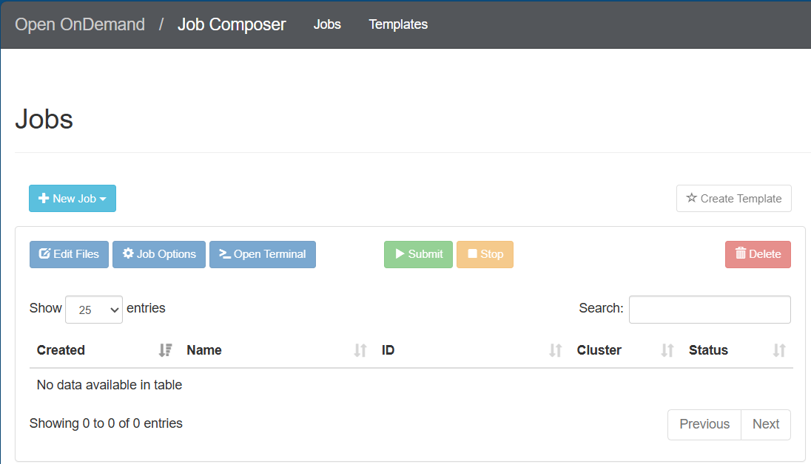

Job Composer
============

To create jobs through Open OnDemand, navigate to Jobs > Jobs Composer from the dashboard.

You will see the below output opened in a new tab. The list of options available to create new jobs are: From Default Template, From Template, From Specified Path, and From Selected Job.

Create Job
----------

From Default Template
^^^^^^^^^^^^^^^^^^^^^

1. On the Job Composer page, select **New Job > From Default Template**.

   .. image:: ../_static/img/ondemand-jobs-output.png
      :alt: select from default template.

   A new job will be created like below.

   .. image:: ../_static/img/ondemand-jobs-default-create.png
      :alt: Job created

2. You can modify the options of the created job like name, Cluster, Job Script using the **Job Options** button.

   .. image:: ../_static/img/ondemand-jobs-default-modify.png
      :alt: option for modifying created job

   After you click the button, you can change the job options like below:

   .. image:: ../_static/img/ondemand_default_jobmodify1.png
      :alt: Jop options were displayed

   In the above example, the Name has been changed from default (Simple Sequential Job) to TestJob. After the name has been modified, hit the **Save** button and the modified job name will be replicated in the Job Composer page.

   Output:
   
   .. image:: ../_static/img/ondemandjobs-default-modify2.png
      :alt: TestJob is created

3. Now, modify the submit script ``main_job.sh``.

   a. On the Job Composer page, hit the **Open Editor** button under Submit Script section.

      .. image:: ../_static/img/ondemand_jobmodify3.png
         :alt: Open editor 

   b. In the text editor opening in a new tab, modify the Job Script with the below content.

      .. image:: ../_static/img/ondemand-jobs-default-modifyscript1.png
         :alt: Modify the job script content

   c. After the job submission script ``main_job.sh`` has been updated, hit the **Save** button. Go back to the previous tab to see the updated script.

      .. image:: ../_static/img/ondemand_jobsmodifying4.png
         :alt: updated transcript is shown

   The Job Details pane also shows important information related to the job.

   .. note::
      If you want to open the submit script file directly in the terminal, use the **Open Terminal** button. **Open Dir** will open the directory in the file manager.

4. Now, hit the **Submit** button. The status will change from *Not Submitted* to *Queued* or *Running*. You will see a success message alert at the top of your page. The status will change to *Completed* once finished.

   .. image:: ../_static/img/ondemand-jobs-default-submit.png
      :alt: Jub Submitted

5. To view the output, click the generated output file ``slurm-<job-id>.out`` under **Folder contents** in the Job Details section.

   .. image:: ../_static/img/ondemand-jobs-default-modify5.png
      :alt: To view the output

   Output (slurm-<job-id>.out):

   .. image:: ../_static/img/ondemand-jobs-default-viewoutput.png
      :alt: Script Output

From Default Template
^^^^^^^^^^^^^^^^^^^^^

From Template
Instead of retyping the Slurm attributes and job parameters for your new job, you can create a custom template and use as a basis for your future jobs.
It also saves time. Also, it’s easier and faster to create a custom template in Open OnDemand. Follow the below steps to create a custom template and compose job from that template.

1. First, create a directory called custom_template under your home directory.
   
   .. code-block:: [asamadi@ssh1 ~]$ mkdir custom_template

   pip install my-package
   python app.py

2. Create the following files, input.txt, script.sh under custom_template directory